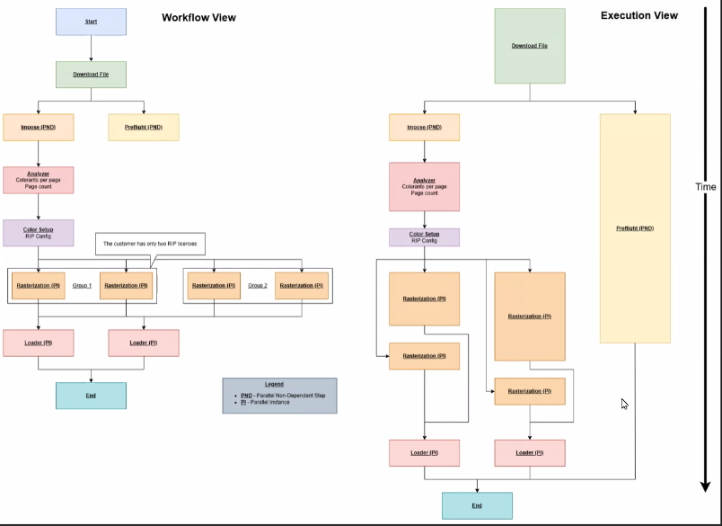

# PrintOS

This is the backend of WSU-V's HP Capstone group project, Fall 2024 - Spring 2025.

We were tasked with creating a full-stack cloud application that supports [Industrial Print](https://www.hp.com/us-en/industrial-digital-presses.html) customers visualize and optimize their print jobs and workflows.

## Running the Application

1. Setup the database.
   * `cd .../hp-capstone-2025-backend`: Navigate to root directory of this project.
   * `cd db`
   * `./run_sql.sh`
2. Test the application.
   * `cd .../hp-capstone-2025-backend`: Navigate to root directory of this project.
   * `cargo test`
3. Start the server.
   * `cd .../hp-capstone-2025-backend`: Navigate to root directory of this project.
   * `cargo run`: Runs the server with default parameters.
     * `cargo run l`: Runs the server on `localhost:5040`.This will *not* interact with our live frontend.
4. Send requests through our frontend at [wsuv-hp-capstone.com](http://wsuv-hp-capstone.com/).

## Example Workflow

## File Structure

<table>
  <thead>
    <tr>
      <th>File</th>
      <th>Description</th>
    </tr>
  </thead>
  <tbody>
    <tr>
      <td><code>src/api.rs</code></td>
      <td>Sets up REST API routes.</td>
    </tr>
    <tr>
      <td><code>src/database.rs</code></td>
      <td>Interfaces with the database and defines the data structures.</td>
    </tr>
    <tr>
      <td><code>src/main.rs</code></td>
      <td>Runs the server.</td>
    </tr>
    <tr>
      <td><code>src/simulation.rs</code></td>
      <td>Simulates a print job going through a workflow.</td>
    </tr>
   <tr>
      <td><code>src/validation.rs</code></td>
      <td>Validates a workflow before it gets inserted into the database.</td>
    </tr>
    <tr>
      <td><code>tests/</code></td>
      <td>Contains test files.</td>
    </tr>
        <tr>
      <td><code>db/</code></td>
      <td>Contains SQLite database binary file, and SQL</td>
    </tr>
  </tbody>
</table>

## Database Schema

This project uses SQLite 3. SQLite stores data in a single file (.db3) The database is executed and maintained via the Rusqlite library for Rust.

If you require access to the database to inspect its contents, or to make changes, you may do so via the `sqlite3` program.

- To access an existing database:
  - `sqlite3 /path/to/database.db3`
- To execute SQL on a database
  - `sqlite3 /path/to/database.db3 < /path/to/file.sql`

### rasterization_profile

Stores the various rasterization profile options. Currently, only the title is stored, but more fields may be added soon.

<table>
  <thead>
    <tr>
      <th>Attribute</th>
      <th>Type</th>
    </tr>
  </thead>
  <tbody>
    <tr>
      <td><code>id (pk)</code></td>
      <td>integer</td>
    </tr>
    <tr>
      <td><code>title</code></td>
      <td>text</td>
    </tr>
  </tbody>
</table>

### printjob

Print jobs are used in conjunction with workflows to run simulations. Factors such as `page_count` and `rasterization_profile` will affect simulation times.

<table>
  <thead>
    <tr>
      <th>Attribute</th>
      <th>Type</th>
    </tr>
  </thead>
  <tbody>
    <tr>
      <td><code>id (pk)</code></td>
      <td>integer</td>
    </tr>
    <tr>
      <td><code>title</code></td>
      <td>text</td>
    </tr>
    <tr>
      <td><code>creation_time</code></td>
      <td>integer</td>
    </tr>
    <tr>
      <td><code>page_count</code></td>
      <td>integer</td>
    </tr>
    <tr>
      <td><code>rasterization_profile_id (fk)</code></td>
      <td>integer</td>
    </tr>
  </tbody>
</table>

### workflow

Workflows simulate print jobs and define the steps involved. The steps of a workflow are stored in the `workflow_step` table and assigned to workflows via the `assigned_workflow_step` table.

<table>
  <thead>
    <tr>
      <th>Attribute</th>
      <th>Type</th>
    </tr>
  </thead>
  <tbody>
    <tr>
      <td><code>id (pk)</code></td>
      <td>integer</td>
    </tr>
    <tr>
      <td><code>title</code></td>
      <td>text</td>
    </tr>
    <tr>
      <td><code>creation_time</code></td>
      <td>integer</td>
    </tr>
    <tr>
      <td><code>total_time_taken</code></td>
      <td>integer</td>
    </tr>
    <tr>
      <td><code>printjobID (fk)</code></td>
      <td>integer</td>
    </tr>
    <tr>
      <td><code>workflowID (fk)</code></td>
      <td>integer</td>
    </tr>
  </tbody>
</table>

### workflow_step

<table>
  <thead>
    <tr>
      <th>Attribute</th>
      <th>Type</th>
    </tr>
  </thead>
  <tbody>
    <tr>
      <td><code>id</code></td>
      <td>integer (pk)</td>
    </tr>
    <tr>
      <td><code>title</code></td>
      <td>text</td>
    </tr>
    <tr>
      <td><code>setup_time</code></td>
      <td>integer</td>
    </tr>
    <tr>
      <td><code>time_per_page</code></td>
      <td>integer</td>
    </tr>
  </tbody>
</table>

### assigned_workflow_step

Assigns workflow steps to specific workflows.

<table>
  <thead>
    <tr>
      <th>Attribute</th>
      <th>Type</th>
    </tr>
  </thead>
  <tbody>
    <tr>
      <td><code>id</code></td>
      <td>integer (pk)</td>
    </tr>
    <tr>
      <td><code>workflow_id (fk)</code></td>
      <td>integer</td>
    </tr>
    <tr>
      <td><code>workflow_step_id (fk)</code></td>
      <td>integer</td>
    </tr>
  </tbody>
</table>

### next_workflow_step

Defines the sequence of steps in a workflow by linking a workflow step to its next step.

<table>
  <thead>
    <tr>
      <th>Attribute</th>
      <th>Type</th>
    </tr>
  </thead>
  <tbody>
    <tr>
      <td><code>assigned_workflow_step_id</code></td>
      <td>integer (pk, fk)</td>
    </tr>
    <tr>
      <td><code>next_step_id</code></td>
      <td>integer (pk, fk)</td>
    </tr>
  </tbody>
</table>

### prev_workflow_step

Defines the reverse sequence of steps in a workflow by linking a workflow step to its previous step.

<table>
  <thead>
    <tr>
      <th>Attribute</th>
      <th>Type</th>
    </tr>
  </thead>
  <tbody>
    <tr>
      <td><code>assigned_workflow_step_id</code></td>
      <td>integer (pk, fk)</td>
    </tr>
    <tr>
      <td><code>prev_step_id</code></td>
      <td>integer (pk, fk)</td>
    </tr>
  </tbody>
</table>

### ran_workflow_step

Tracks the execution of workflow steps within a simulation report. These haven't been implemented yet.

<table>
  <thead>
    <tr>
      <th>Attribute</th>
      <th>Type</th>
    </tr>
  </thead>
  <tbody>
    <tr>
      <td><code>workflow_step_id (fk)</code></td>
      <td>integer</td>
    </tr>
    <tr>
      <td><code>simulation_report_id (fk)</code></td>
      <td>integer</td>
    </tr>
    <tr>
      <td><code>time_taken</code></td>
      <td>integer</td>
    </tr>
  </tbody>
</table>

### Other Data Structures

These could either be hardcoded or stored in a database:

* **Rules:** A data structure that enforces constraints on data being entered into the database. For example, ensuring specific workflow steps are performed in a particular order (e.g., printing must occur before laminating). These rules can be requested by the frontend to provide real-time feedback when creating resources. The frontend sends the validated data to the backend, where the same rules are enforced.

## REST API

In this application, we use [RESTful API](https://restfulapi.net/) [HTTP methods](https://restfulapi.net/http-methods/).

### GET

* `GET /[COLL]?opt_param1=example1&opt_param2=example2`
  Retrieves all documents from a collection matching the given parameters. If no parameters are specified, returns the entire collection.

  * **200 (OK):** Returns a list of documents (can be empty).
  * **400 (Bad Request):** Improperly formatted query.
* `GET /[COLL]/:id`
  Retrieves a specific document by ID.

  * **200 (OK):** Returns the document.
  * **400 (Bad Request):** Invalid ID format.
  * **404 (Not Found):** Document does not exist.

### POST

* `POST /RasterizationProfile`
  Creates a new rasterization profile. Request body includes:

  * `id`
  * `title`
* `POST /PrintJob`
  Creates a new print job. Request body includes:

  * `Title`
  * `DateCreated`
  * `PageCount`
  * `RasterizationProfile`
* `POST /Workflow`
  Creates a new workflow. Request body includes:

  * `Title`
  * `WorkflowSteps`
  * **201 (Created):** Returns new Workflow ID.
  * **422 (Unprocessable Entity):** Invalid workflow; does not pass validation rules.
* `POST /SimulationReport`
  Creates a new simulation report. Request body includes:

  * `pj_id`
  * `wf_id`
  * **201 (Created):** Returns new SimulationReport ID.

### DELETE

* `DELETE /RasterizationProfile/:id`
  Deletes a specific print job by ID.

  * **204 (No Content):** Successful deletion.
  * **400 (Bad Request):** Invalid ID format.
  * **404 (Not Found):** Document does not exist.
  * **409 (Conflict):** Existing PrintJob rely on this PrintJob.
* `DELETE /PrintJob/:id`
  Deletes a specific print job by ID.

  * **204 (No Content):** Successful deletion.
  * **400 (Bad Request):** Invalid ID format.
  * **404 (Not Found):** Document does not exist.
  * **409 (Conflict):** Existing SimulationReports rely on this PrintJob.
* `DELETE /Workflow/:id`
  Deletes a specific workflow by ID.

  * **204 (No Content):** Successful deletion.
  * **400 (Bad Request):** Invalid ID format.
  * **404 (Not Found):** Document does not exist.
  * **409 (Conflict):** Existing SimulationReports rely on this Workflow.
* `DELETE /SimulationReport/:id`
  Deletes a specific simulation report by ID.

  * **204 (No Content):** Successful deletion
